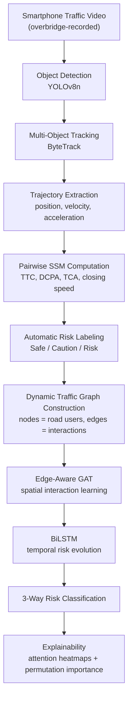

# Explainable Edge-Aware GAT + BiLSTM for Spatiotemporal Crash Risk Forecasting

**An Empirical Study on Dhaka Traffic Video**

A complete pipeline that turns ordinary smartphone traffic video into frame-level crash-risk forecasts (**Safe / Caution / Risk**) for mixed, non-lane-based traffic — no historical crash records required.

> Built and evaluated on five smartphone videos recorded from pedestrian overbridges around Dhaka, Bangladesh. Risk labels are derived automatically from surrogate safety measures (time-to-collision, DCPA, closing speed), and a custom Edge-Aware Graph Attention Network + BiLSTM learns to forecast risk up to 5 seconds ahead of a potential near-miss.

📄 **[Read the full paper (PDF)](./An_Empirical_Study_on_Dhaka_Traffic_Video_Conference%20Paper.pdf)** &nbsp;·&nbsp; 📓 **[Open the notebook](./thesis-spatiotemporal-crash-risk-prediction.ipynb)**

---

## Highlights

- 🎯 **82.1% accuracy / 0.695 macro-F1** — the proposed GAT+BiLSTM outperforms Random Forest, Logistic Regression, and a graph-free BiLSTM ablation on an identical, leakage-free 70/15/15 split.
- 🔍 **+25.6-point macro-F1 gain** attributable purely to graph attention (controlled ablation vs. a BiLSTM trained on the same pooled features, no edge modeling).
- 📈 **Data-scale reversal, documented, not hidden**: on a smaller 4-video corpus, Random Forest led by a wide margin (0.748 vs. 0.458 macro-F1). Adding one denser video — no architecture changes — flipped the ranking. The paper analyzes *why*.
- 🧠 **Built-in explainability**: permutation feature importance for the classical baseline, raw GAT attention heatmaps for the proposed model — both converge on **minimum time-to-collision** as the dominant risk signal.
- 🏷️ **Annotation-free labels**: no manually labeled crash dataset needed. Risk labels come directly from physics-based surrogate safety measures computed on tracked trajectories.

---

## Why This Problem Is Hard

Road traffic injuries are among the leading causes of death worldwide, and the burden falls disproportionately on low- and middle-income countries with heterogeneous, non-lane-based traffic. Dhaka is a representative case: rickshaws, buses, cars, motorcycles, and pedestrians share the same carriageway with minimal lane discipline.

Two structural problems block conventional approaches:

1. **Sparse ground truth** — historical crash records in Bangladesh are sparse, inconsistently reported, and rarely geo-referenced, ruling out the large labeled crash datasets that deep models typically need.
2. **Reactive systems** — most existing crash-detection systems flag a collision *after* it happens, rather than forecasting risk far enough ahead to allow a warning.

This project addresses both by deriving dense, physically interpretable risk labels from everyday traffic video using surrogate safety measures (SSMs), and training a spatiotemporal graph model to forecast near-miss risk several seconds in advance.

---

## Pipeline



---

## Dataset

All trajectory, interaction, and risk-label data come from **five smartphone traffic videos** recorded from pedestrian overbridges at different locations in and around Dhaka (not fixed CCTV). A separate public image set (Bangladeshi Traffic Flow Dataset) was used only to sanity-check the pretrained detector — it contributes no labels or trajectories.

| Video | Processed frames | Tracked detections |
|---|---|---|
| Airport | 2,417 | 33,712 |
| Rajlokkhi | 1,219 | 22,207 |
| Ajampur1 | 1,208 | 20,344 |
| Dhaka test clip | 102 | 1,084 |
| Arambag (double lane) | 203 | 245 |
| **Total** | **5,149** | **77,592** |

- Frames sampled with stride 3; six road-user classes retained after filtering spurious COCO classes (e.g. boat, bench).
- **513,035 pairwise interactions** computed (distance, relative/closing speed, TCA, TTC, DCPA, size-based safety radius).
- Automatic labeling over a 5-second horizon produced **359,124 safe / 102,607 caution / 51,304 risk** interaction labels, aggregating to **5,071 labeled frames** (3,549 / 1,014 / 508 — a 7:2:1 imbalance preserved across a stratified 70/15/15 split).
- Frames group into overlapping 10-frame sequences, giving **5,026 graph sequences** for the spatiotemporal model.

---

## Methodology

### Automatic risk labeling

Interaction-level labels are derived directly from surrogate safety measures — no manual annotation:

- **Risk**: time-to-closest-approach ≤ 2.0 s **and** DCPA ≤ 1.0× safety radius **and** closing speed > 0
- **Caution**: within the 5-second horizon and moderately close, or already close (d ≤ 1.25× safety radius)
- **Safe**: otherwise

A continuous risk score combining time, distance, and speed components is also computed for finer-grained analysis.

### Models compared (identical, leakage-free 70/15/15 split for all four)

| Model | Description | Params |
|---|---|---|
| Logistic Regression | Linear, class-balanced, on 27 hand-engineered frame-level aggregate features | — |
| Random Forest | 300 class-balanced trees, max depth 10 | — |
| BiLSTM (sequence only) | Bidirectional LSTM over pooled per-frame node features — **no graph structure**, isolates the value of edge modeling | 57,859 |
| **GAT + BiLSTM (proposed)** | Two stacked edge-aware GAT layers → masked mean pooling → BiLSTM over 10-frame sequences → classification head | 106,053 |

### Proposed model: Edge-Aware GAT + BiLSTM

Each frame is represented as a graph (up to 20 nodes, padded/masked): nodes carry a 9-dim motion/size/class feature vector, edges carry the pairwise SSM features. Two Edge-Aware GAT layers compute attention over each node pair using both node and edge features, so the model can weight *which specific interaction* matters rather than relying on fixed, pre-aggregated statistics. The resulting per-frame graph embeddings feed a single-layer BiLSTM that models how risk evolves over a 10-frame temporal window, followed by a small classification head.

---

## Results

### Overall test-set performance (5-video dataset)

| Rank | Model | Accuracy | Macro F1 | Weighted F1 | Macro ROC-AUC |
|---|---|---|---|---|---|
| 1 | **GAT + BiLSTM (proposed)** | **0.821** | **0.695** | **0.812** | 0.889 |
| 2 | Random Forest | 0.756 | 0.669 | 0.767 | **0.890** |
| 3 | Logistic Regression | 0.615 | 0.500 | 0.642 | 0.770 |
| 4 | BiLSTM (sequence only) | 0.606 | 0.439 | 0.620 | 0.696 |

Random Forest holds a marginally higher ROC-AUC, so the top two are effectively tied on ranking ability — but GAT+BiLSTM produces better-calibrated hard decisions.

### Class-wise metrics

| Model | Class | Precision | Recall | F1 |
|---|---|---|---|---|
| GAT + BiLSTM | Safe | 0.879 | 0.947 | 0.911 |
| GAT + BiLSTM | Caution | 0.597 | 0.550 | 0.572 |
| GAT + BiLSTM | Risk | 0.787 | 0.487 | 0.602 |
| Random Forest | Safe | 0.903 | 0.824 | 0.862 |
| Random Forest | Caution | 0.436 | 0.559 | 0.490 |
| Random Forest | Risk | 0.638 | 0.671 | 0.654 |
| BiLSTM (seq. only) | Safe | 0.795 | 0.734 | 0.763 |
| BiLSTM (seq. only) | Caution | 0.299 | 0.311 | 0.305 |
| BiLSTM (seq. only) | Risk | 0.209 | 0.303 | 0.247 |

On the safety-critical **Risk** class, GAT+BiLSTM has the highest precision (78.7%, few false alarms) but lower recall than Random Forest (48.7% vs. 67.1%) — Random Forest catches more true risk frames but with more false positives. The two models are complementary: GAT+BiLSTM as a trustworthy confirmatory alarm, Random Forest as a sensitive first-pass detector.

### Effect of dataset scale

| Quantity | 4-video iteration | 5-video iteration |
|---|---|---|
| Labeled frames | 2,654 | 5,071 |
| Risk-labeled frames | 266 | 508 |
| Params per risk frame (GAT+BiLSTM) | ~399 | ~209 |
| Random Forest macro-F1 | 0.748 | 0.669 |
| GAT+BiLSTM macro-F1 | 0.458 | **0.695** |
| BiLSTM-only macro-F1 | 0.469 | 0.439 |
| **Best model** | Random Forest | **GAT+BiLSTM** |

This is the paper's central diagnostic finding: the graph-attention model was **data-starved, not architecturally unsuited**. Nearly every classical-baseline metric stayed flat or slipped slightly at the larger scale, while every GAT+BiLSTM metric improved sharply — the exact asymmetry expected of a capacity-constrained deep model as more data becomes available.

---

## Explainability

- **Random Forest**: permutation feature importance (20 repeats, macro-F1 scoring) on the held-out test set.
- **GAT + BiLSTM**: raw attention weights extracted from the final GAT layer, visualized as a source/target heatmap. At the larger data scale, attention becomes visibly sharper and more concentrated on specific interacting pairs, rather than diffuse.
- Both explainability methods independently converge on **minimum time-to-collision** as the single most informative risk signal.

---

## Repository Contents

| File | Description |
|---|---|
| [`thesis-spatiotemporal-crash-risk-prediction.ipynb`](./thesis-spatiotemporal-crash-risk-prediction.ipynb) | End-to-end notebook: YOLOv8 detection → ByteTrack tracking → trajectory/SSM feature engineering → automatic risk labeling → graph construction → baseline ML models → BiLSTM ablation → Edge-Aware GAT+BiLSTM → evaluation → explainability (XAI) |
| [`An_Empirical_Study_on_Dhaka_Traffic_Video_Conference Paper.pdf`](./An_Empirical_Study_on_Dhaka_Traffic_Video_Conference%20Paper.pdf) | Full write-up: *Explainable Edge-Aware Graph Attention and BiLSTM Framework for Spatiotemporal Crash Risk Forecasting in Mixed Traffic* |
| [`README.md`](./README.md) | This file |

> The notebook was developed and run on Kaggle, so file paths reference `/kaggle/input/...` and `/kaggle/working/...`. To run locally, point these paths at your own video files and output directory.

---

## Getting Started

### Requirements

```
python >= 3.9
torch
ultralytics        # YOLOv8 + ByteTrack
pandas
numpy
scikit-learn
matplotlib
opencv-python
```

```bash
pip install torch ultralytics pandas numpy scikit-learn matplotlib opencv-python
```

### Running the pipeline

The notebook is organized as a sequence of self-contained experiments — run top to bottom:

1. **Detection sanity-check** — pretrained YOLOv8n on the Bangladeshi Traffic Flow image dataset.
2. **Video tracking** — YOLOv8n + ByteTrack over the smartphone videos to produce per-object trajectories.
3. **Feature engineering** — speed, acceleration, and pairwise SSMs (TTC, DCPA, TCA, closing speed).
4. **Automatic risk labeling** — interaction-level and frame-level Safe/Caution/Risk labels.
5. **Graph construction** — per-frame node/edge tensors, grouped into 10-frame sequences.
6. **Baselines** — Logistic Regression and Random Forest on hand-engineered aggregate features.
7. **BiLSTM ablation** — sequence-only model, no graph structure.
8. **Proposed model** — Edge-Aware GAT + BiLSTM, training and evaluation.
9. **Explainability** — permutation importance and GAT attention heatmaps.

Update the input video paths and output directory at the top of each section to match your environment.

---

## Limitations

- Risk labels are generated automatically from surrogate safety measures, not verified against real crash or near-miss records — TTC/DCPA-based labeling is a well-established proxy, but absolute performance numbers should be read as relative comparisons between models rather than calibrated real-world probabilities.
- The dataset comes from only five videos at five physical locations; the train/val/test split is stratified by label but not by video, so some scene-specific visual leakage across splits is possible.
- Classical baselines are trained on aggregate features built from the same TTC/DCPA computation used for labeling — a form of feature-label alignment a deployed system without ground-truth SSMs wouldn't have.
- All recordings are daytime, dry-weather, fixed-overbridge footage; performance at night, in rain/fog, or from a moving camera is untested.
- Results are single-run (no multi-seed averaging), so exact gap magnitudes carry some run-to-run variance typical of small-data deep learning.

## Future Work

- Continue adding video from more locations, times of day, and weather conditions — data scale was the dominant factor in this study.
- Combine both models' complementary strengths in an ensemble or two-stage cascade (Random Forest as a high-recall filter, GAT+BiLSTM as a high-precision confirmatory stage).
- Further ablations on GAT layer/head count and auxiliary SSM regression to close the risk-class recall gap architecturally.
- Grad-CAM-style overlays on the source video, combined with GAT attention weights, to highlight which vehicles triggered an alert directly on the frame.

---

## Citation

If you use this work, please cite:

```bibtex
@unpublished{dhaka_crash_risk_gat_bilstm,
  title  = {Explainable Edge-Aware Graph Attention and BiLSTM Framework for
            Spatiotemporal Crash Risk Forecasting in Mixed Traffic:
            An Empirical Study on Dhaka Traffic Video},
  author = {[Add author name(s)]},
  year   = {2026},
  note   = {Preprint / thesis project}
}
```

## References

1. World Health Organization, *Global status report on road safety 2023*.
2. Erkartal & Yılmaz, "A novel hybrid deep learning-probabilistic framework for real-time crash detection from monocular traffic video," *Applied Sciences*, 2025.
3. Minderhoud & Bovy, "Extended time-to-collision measures for road traffic safety assessment," *Accident Analysis & Prevention*, 2001.
4. Nippani et al., "Graph neural networks for road safety modeling," NeurIPS Datasets and Benchmarks Track, 2023.
5. Alnowaiser, "A computational intelligence GNN-LSTM framework for spatiotemporal prediction of traffic accident severity using SHAP XAI," *Int. J. Computational Intelligence Systems*, 2025.
6. Li & Chen, "Traffic accident risk prediction based on deep learning and spatiotemporal features of vehicle trajectories," *PLOS ONE*, 2025.
7. Veličković et al., "Graph Attention Networks," ICLR, 2018.
8. Jocher, Chaurasia & Qiu, "Ultralytics YOLOv8," 2023.
9. Zhang et al., "ByteTrack: Multi-object tracking by associating every detection box," ECCV, 2022.
10. Wojke, Bewley & Paulus, "Simple online and realtime tracking with a deep association metric," ICIP, 2017.
11. Fisher, Rudin & Dominici, "Random forests and permutation importance," *JMLR*, 2019.
12. Selvaraju et al., "Grad-CAM: Visual explanations from deep networks via gradient-based localization," ICCV, 2017.
13. Breiman, "Random forests," *Machine Learning*, 2001.
14. Hochreiter & Schmidhuber, "Long short-term memory," *Neural Computation*, 1997.

---

## License

*Add your preferred license here (e.g. MIT, Apache 2.0) before publishing.*
